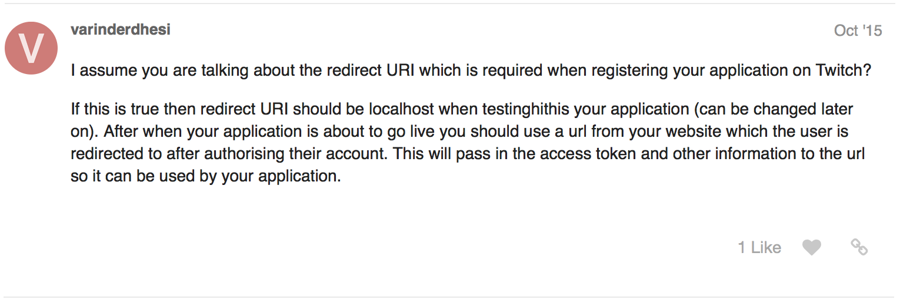

# The Hunter #
A Twitch.tv Bot for my Friends

### Usage ###
While I have decided to make my bot open source, you must ask me for permission to use it.

If I do give you permission, all I ask is that you give me credit. Don't be a jerk :)

### Helpful Notes ###

**How To Handle the Redirect URI with Twitch**
[What Goes on the Redirect URI - Twitch?](https://discuss.dev.twitch.tv/t/what-goes-on-the-redirect-uri/1035/2)

**Installing the IRC npm Package**
[Node IRC Installation](https://github.com/martynsmith/node-irc)

[Node IRC Documentation](https://node-irc.readthedocs.io/en/latest/)

[Build Errors with the Node ICU Character Set Detection Dependency](https://github.com/martynsmith/node-irc/issues/308)
In short.... you don't need the dependency. Just ignore the error.
